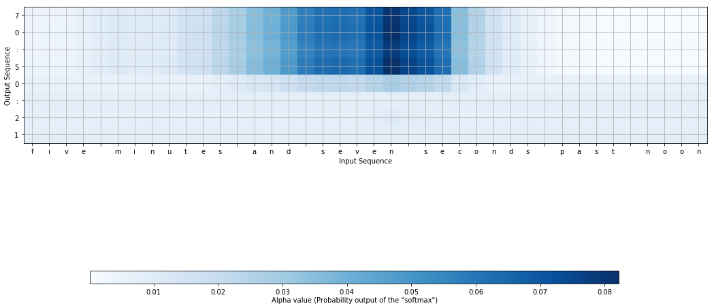

<!-- markdown-toc start - Don't edit this section. Run M-x markdown-toc-refresh-toc -->
**Table of Contents**

- [Intro](#intro)
- [Implementation](#implementation)
- [Result](#result)
- [Conclusion](#conclusion)

<!-- markdown-toc end -->

# Intro

Going beyond the encoder-decoder architectures of RNNs, I'm experimenting with the attention model.

This experiment takes as input an English sentence `five minutes and seven seconds past noon` and predicts the time `12:05:07`.

# Implementation

The details can be seen in the notebooks, one for the [model](https://github.com/opyate/deeptime/blob/master/notebook.ipynb) and another for the [attention map](https://github.com/opyate/deeptime/blob/master/attention.ipynb).

**I think the illustration suffers a bit due to the short inputs**, so I'll be working on an experiment that uses longer inputs (perhaps revisiting my [fake news generator](https://opyate.com/made/2014-02-14-plus-one-news)).

Also, I was again reminded that most of the work goes into preparing the dataset. I spent a considerable amount of time on the [human/machine time generator](https://github.com/opyate/deeptime/blob/master/wordstime.py) (and associated [test cases](https://github.com/opyate/deeptime/blob/master/test_wordstime.py)).

# Result

This graph shows where the neural net "looked" at `five minutes and seven seconds past noon` when piecing together  `12:05:07`. The word `seven` has a clear attraction to `07`. As for the hours and minutes, fellow ML-er [Neil](https://datascience.stackexchange.com/users/836/neil-slater) thinks the saliency is spread out more for the minutes and hours, due to the net accepting "to" vs "from", and so forth.

# Conclusion

There you have it, ladies and gents. Amateur hour is over, and I'm excited to work on my next small showcase (whilst chiseling away at the new model for [my side project](https://pdfcrun.ch/)).
